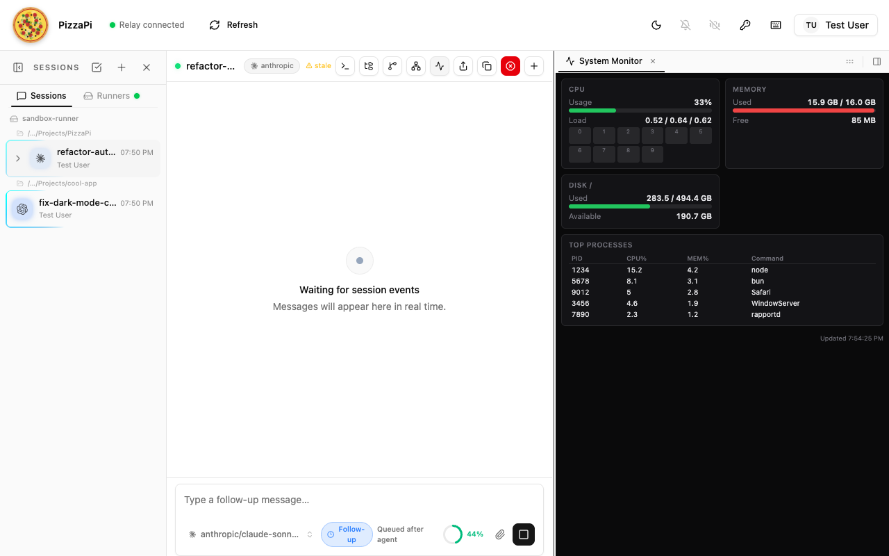

import { Aside, FileTree, Steps } from "@astrojs/starlight/components";

Runner services are background processes on the runner daemon. They can expose interactive **UI panels** in the PizzaPi web interface and advertise **custom triggers** that agent sessions can subscribe to. Each service is discovered automatically from `~/.pizzapi/services/` on startup.



---

## Quick Start

<Steps>

1. **Create the service directory:**

   ```bash
   mkdir -p ~/.pizzapi/services/my-service/panel
   ```

2. **Add `manifest.json`:**

   ```json
   {
     "id": "my-service",
     "label": "My Service",
     "icon": "activity",
     "entry": "./index.ts",
     "panel": {
       "dir": "./panel"
     },
     "triggers": [
       {
         "type": "my-service:something_happened",
         "label": "Something Happened",
         "description": "Emitted when something noteworthy occurs"
       }
     ]
   }
   ```

3. **Add `index.ts`** with a ServiceHandler class (see [ServiceHandler API](#servicehandler-api) below).

4. **Add `panel/index.html`** with self-contained HTML/CSS/JS (see [Panel Guidelines](#panel-guidelines) below).

5. **Restart the runner** — the panel button appears in the session toolbar header, and triggers become discoverable by agents.

</Steps>

---

## Folder Structure

<FileTree>
- ~/.pizzapi/services/my-service/
  - manifest.json — metadata, panel config, and trigger definitions
  - index.ts — ServiceHandler module (default export)
  - panel/
    - index.html — self-contained UI (HTML/CSS/JS)
    - … — additional static assets
</FileTree>

Services can also be bundled inside Claude Code plugins:

<FileTree>
- ~/.pizzapi/plugins/my-plugin/
  - plugin.json
  - services/
    - my-service/
      - manifest.json
      - index.ts
      - panel/
        - index.html
</FileTree>

---

## manifest.json

```json
{
  "id": "my-service",
  "label": "My Service",
  "icon": "activity",
  "entry": "./index.ts",
  "panel": {
    "dir": "./panel"
  },
  "triggers": [
    {
      "type": "my-service:something_happened",
      "label": "Something Happened",
      "description": "Emitted when something noteworthy occurs",
      "schema": {
        "type": "object",
        "properties": {
          "itemId": { "type": "string" },
          "timestamp": { "type": "number" }
        }
      }
    }
  ]
}
```

| Field | Required | Default | Description |
|-------|----------|---------|-------------|
| `id` | Yes | — | Unique service ID (must match `ServiceHandler.id`) |
| `label` | Yes | — | Button label shown in the PizzaPi header bar |
| `icon` | No | `"square"` | [Lucide](https://lucide.dev/icons) icon name (kebab-case) |
| `entry` | No | `"./index.ts"` | Service module path relative to the service folder |
| `panel.dir` | No | `"./panel"` | Panel static files directory (omit if no panel) |
| `triggers` | No | `[]` | Trigger type definitions (see below) |

---

## Custom Triggers

Services can advertise custom trigger types that agent sessions subscribe to at runtime. This is the primary mechanism for services to push events into agent conversations.

### Declaring Triggers

Add a `triggers` array to `manifest.json`. Each entry describes a trigger type:

| Field | Required | Description |
|-------|----------|-------------|
| `type` | Yes | Namespaced trigger type, e.g. `"my-service:event_name"` |
| `label` | Yes | Human-readable label for the UI and agent tools |
| `description` | No | When/why this trigger fires |
| `schema` | No | JSON Schema describing the trigger payload |

```json
"triggers": [
  {
    "type": "my-service:file_changed",
    "label": "File Changed",
    "description": "A watched file was modified",
    "schema": {
      "type": "object",
      "properties": {
        "path": { "type": "string" },
        "changeType": { "type": "string", "enum": ["created", "modified", "deleted"] }
      }
    }
  }
]
```

Trigger types are advertised to all connected viewers and agent sessions via the `service_announce` event when the runner starts.

### Firing Triggers

To deliver a trigger to subscribed sessions, `POST` to the relay's broadcast endpoint:

```
POST /api/runners/{runnerId}/trigger-broadcast
```

```typescript
await fetch(`${relayUrl}/api/runners/${runnerId}/trigger-broadcast`, {
    method: "POST",
    headers: {
        "Content-Type": "application/json",
        "x-api-key": apiKey,
    },
    body: JSON.stringify({
        type: "my-service:file_changed",
        payload: { path: "/src/app.ts", changeType: "modified" },
        source: "my-service",
        deliverAs: "followUp",
        summary: "File changed: /src/app.ts",
    }),
});
```

| Field | Required | Description |
|-------|----------|-------------|
| `type` | Yes | Must match a type declared in the manifest `triggers[]` array |
| `payload` | Yes | Arbitrary JSON object delivered to subscribers |
| `source` | No | Identifier shown in trigger history (typically the service name) |
| `deliverAs` | No | `"steer"` interrupts the current turn; `"followUp"` (default) queues after the turn ends |
| `summary` | No | Human-readable one-liner for trigger history |

The relay fans out the trigger to every session subscribed to that type on this runner.

Subscription params are matched against the trigger payload at delivery time. Scalar params use loose equality, array payload fields match if they contain the subscriber's value, and param names ending in `Contains` do substring matching against string payload fields.

<Aside type="tip">
  Use `"followUp"` (default) for non-urgent events. Use `"steer"` only when the trigger needs to interrupt whatever the agent is currently doing.
</Aside>

### Relay Connection Details

Services need three values to fire triggers:

| Value | Source |
|-------|--------|
| `runnerId` | Read from `~/.pizzapi/runner.json` (written by the daemon on startup) |
| `apiKey` | `PIZZAPI_API_KEY` or `PIZZAPI_RUNNER_API_KEY` environment variable |
| `relayUrl` | `PIZZAPI_RELAY_URL` env var, or `relayUrl` in `~/.pizzapi/config.json` |

<Aside type="caution">
  Read these values at call time, not at `init()` time — the runner ID or relay URL could change if the daemon reconnects.
</Aside>

### Agent Interaction

Once triggers are advertised, agents can interact with them using built-in tools:

| Agent action | Tool |
|-------------|------|
| Discover available triggers | `list_available_triggers()` |
| Subscribe to a trigger type | `subscribe_trigger("my-service:file_changed")` |
| Unsubscribe | `unsubscribe_trigger("my-service:file_changed")` |
| View subscriptions | `list_trigger_subscriptions()` |

Subscribed triggers arrive as injected messages in the agent's conversation, with the payload and metadata from the broadcast.

### Services Without Panels

A service doesn't need a UI panel. Omit `panel` from the manifest and skip `announcePanel()`. The service still runs in the background and can fire triggers:

```json
{
  "id": "my-watcher",
  "label": "File Watcher",
  "entry": "./index.ts",
  "triggers": [
    { "type": "my-watcher:file_changed", "label": "File Changed" }
  ]
}
```

---

## ServiceHandler API

The service module must default-export a class implementing the ServiceHandler interface:

```typescript
import { existsSync, readFileSync } from "node:fs";
import { join, dirname } from "node:path";
import { homedir } from "node:os";
import { fileURLToPath } from "node:url";
import type { Server } from "bun";

// ── Relay helpers (for firing triggers) ───────────────────────────────────

function readRunnerId(): string | null {
    try {
        const home = process.env.HOME || homedir();
        const raw = JSON.parse(readFileSync(join(home, ".pizzapi", "runner.json"), "utf-8"));
        return typeof raw?.runnerId === "string" ? raw.runnerId : null;
    } catch { return null; }
}

function resolveRelayUrl(): string {
    const home = process.env.HOME || homedir();
    let raw = process.env.PIZZAPI_RELAY_URL?.trim();
    if (!raw) {
        try {
            const cfg = JSON.parse(readFileSync(join(home, ".pizzapi", "config.json"), "utf-8"));
            if (typeof cfg?.relayUrl === "string" && cfg.relayUrl !== "off") raw = cfg.relayUrl.trim();
        } catch { /* ignore */ }
    }
    raw = raw || "http://localhost:7492";
    if (raw.startsWith("ws://"))  return raw.replace(/^ws:/, "http:").replace(/\/$/, "");
    if (raw.startsWith("wss://")) return raw.replace(/^wss:/, "https:").replace(/\/$/, "");
    return raw.replace(/\/$/, "");
}

function getApiKey(): string | null {
    return process.env.PIZZAPI_RUNNER_API_KEY ?? process.env.PIZZAPI_API_KEY ?? null;
}

async function broadcastTrigger(
    type: string,
    payload: Record<string, unknown>,
    opts?: { deliverAs?: "steer" | "followUp"; summary?: string },
): Promise<void> {
    const runnerId = readRunnerId();
    const apiKey = getApiKey();
    if (!runnerId || !apiKey) return;

    await fetch(`${resolveRelayUrl()}/api/runners/${runnerId}/trigger-broadcast`, {
        method: "POST",
        headers: { "Content-Type": "application/json", "x-api-key": apiKey },
        body: JSON.stringify({
            type,
            payload,
            source: "my-service",
            deliverAs: opts?.deliverAs ?? "followUp",
            summary: opts?.summary,
        }),
    }).catch(err => console.error("[my-service] trigger broadcast failed:", err));
}

// ── Service ───────────────────────────────────────────────────────────────

class MyService {
    get id() { return "my-service"; }

    #server: Server | null = null;

    init(_socket: any, { announcePanel }: any) {
        const panelDir = join(dirname(fileURLToPath(import.meta.url)), "panel");
        const indexHtml = readFileSync(join(panelDir, "index.html"), "utf-8");

        this.#server = Bun.serve({
            port: 0,
            fetch: async (req) => {
                const url = new URL(req.url);

                if (url.pathname.endsWith("/api/data")) {
                    return Response.json({ hello: "world" }, {
                        headers: { "Access-Control-Allow-Origin": "*" },
                    });
                }

                if (url.pathname.endsWith("/api/do-thing") && req.method === "POST") {
                    // Fire a trigger to all subscribed agent sessions
                    void broadcastTrigger("my-service:something_happened", {
                        itemId: "abc-123",
                        timestamp: Date.now(),
                    }, { summary: "A thing happened" });

                    return Response.json({ ok: true }, {
                        headers: { "Access-Control-Allow-Origin": "*" },
                    });
                }

                return new Response(indexHtml, {
                    headers: { "Content-Type": "text/html; charset=utf-8" },
                });
            },
        });

        if (announcePanel) {
            announcePanel(this.#server.port);
        }
    }

    dispose() {
        if (this.#server) {
            this.#server.stop(true);
            this.#server = null;
        }
    }
}

export default MyService;
```

**Lifecycle:**
- **`init(socket, context)`** — called when the runner starts. Start your HTTP server, call `announcePanel(port)` to register the panel, and set up any trigger-firing logic.
- **`dispose()`** — called on shutdown. Must clean up the HTTP server to avoid port leaks.

<Aside type="caution">
  Always call `announcePanel(port)` after starting your server — without it, the panel won't appear in the UI. If your service has no panel, skip this call.
</Aside>

---

## Panel Guidelines

Panels render inside a **280px-tall iframe** in the PizzaPi web interface. Key constraints:

- **Self-contained** — all CSS and JS must be inline (no build step required)
- **Dark theme** — match PizzaPi's dark UI:
  ```css
  body { background: #0a0a0b; color: #e4e4e7; font-size: 11px; }
  /* Borders: #27272a */
  ```
- **Relative API URLs** — use `./api/data` (the tunnel proxy preserves the path)
- **Polling for live data** — use `setInterval` + `fetch` (typically 3–5s intervals)
- **No external CDN scripts** — the iframe is sandboxed; external scripts may be blocked
- **CORS headers** — API responses need `Access-Control-Allow-Origin: *`

---

## How It Works

1. The runner daemon discovers service folders in `~/.pizzapi/services/` (and plugin `services/` dirs)
2. It reads `manifest.json` for panel metadata and trigger definitions
3. It loads the service module and calls `init(socket, { announcePanel })`
4. The service starts `Bun.serve()` on port 0 and calls `announcePanel(port)`
5. The daemon aggregates all trigger defs from all loaded services
6. The daemon emits a `service_announce` event with the panels and trigger defs
7. The UI renders panel iframes; agents discover triggers via `list_available_triggers()`
8. When a service fires a trigger via `POST /api/runners/{runnerId}/trigger-broadcast`, the relay fans it out to all subscribed sessions

---

## Quick Reference

| Task | How |
|------|-----|
| Declare triggers | Add `triggers[]` array to `manifest.json` |
| Fire a trigger | `POST /api/runners/{runnerId}/trigger-broadcast` with API key |
| Serve static files | `Bun.serve()` with `readFileSync` for `index.html` |
| Expose an API | Add route checks in the `fetch` handler |
| Get a random port | `Bun.serve({ port: 0 })` then read `.port` |
| Announce the panel | Call `announcePanel(server.port)` in `init()` |
| Match PizzaPi theme | `#0a0a0b` bg, `#e4e4e7` text, `#27272a` borders |
| Choose an icon | Browse [lucide.dev/icons](https://lucide.dev/icons), use kebab-case |

---

## Troubleshooting

| Problem | Fix |
|---------|-----|
| Triggers declared but not delivered | You must fire them via the relay broadcast API — declaring them in the manifest only advertises them |
| Missing runnerId or apiKey | Read from `~/.pizzapi/runner.json` and env vars at call time, not init time |
| Panel doesn't appear in UI | Check that `announcePanel()` is called after the server starts |
| Blank panel iframe | Tunnel proxy can't reach local server — check the service is still running |
| API calls fail in panel | Add `Access-Control-Allow-Origin: *` header to API responses |
| Large panel doesn't fit | Panel container is 280px tall — design accordingly |
| Absolute API URLs break | Use relative URLs (`./api/...`) — the tunnel proxy rewrites paths |
| Port leak after restart | Ensure `dispose()` calls `server.stop(true)` |
